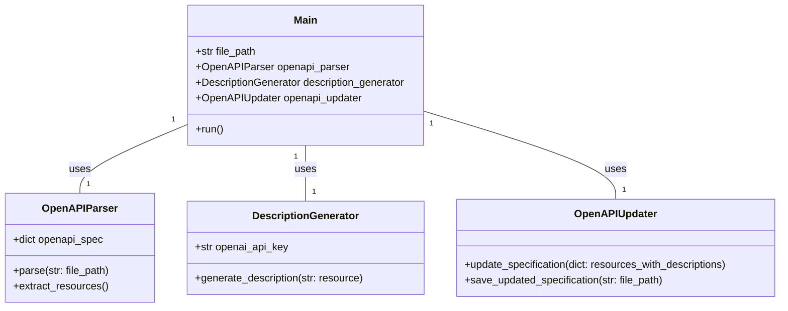
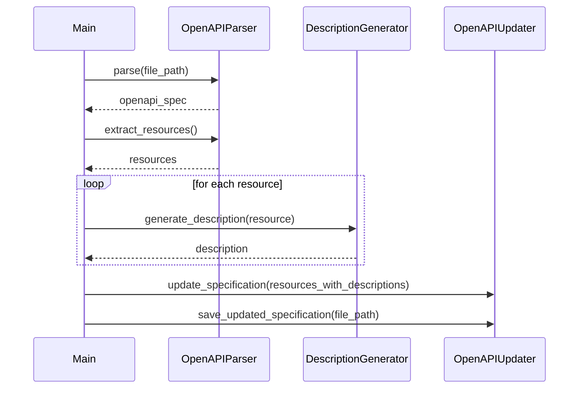

## Implementation approach
We will use PyYAML to read and write YAML files, and OpenAI's GPT-3 model to generate descriptions. The application will be a command-line interface (CLI) application, as it is the simplest and most straightforward way to implement the requirements. The application will first read the OpenAPI specification from the provided file path, extract the necessary information, and generate descriptions for the resources using the GPT-3 model. It will then update the original specification with the generated descriptions and save the updated specification in the same folder with the prefix 'updated_'.

## Python package name
```python
"openapi_description_generator"
```

## File list
```python
[
    "main.py",
    "openapi_parser.py",
    "description_generator.py",
    "openapi_updater.py"
]
```

## Data structures and interface definitions


## Program call flow


## Anything UNCLEAR
The requirement is clear to me.